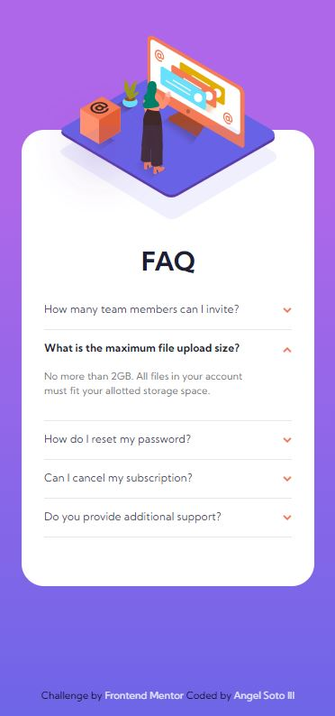
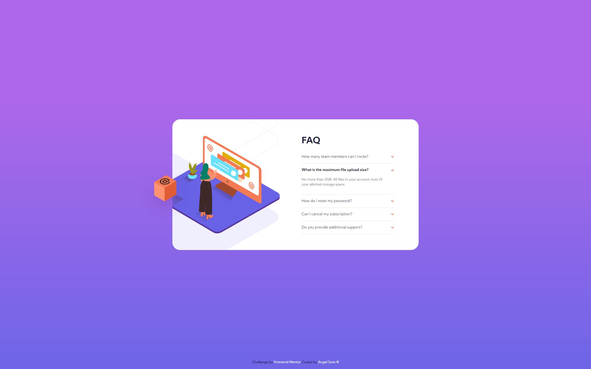

# Frontend Mentor - FAQ accordion card solution

This is a solution to the [FAQ accordion card challenge on Frontend Mentor](https://www.frontendmentor.io/challenges/faq-accordion-card-XlyjD0Oam). Frontend Mentor challenges help you improve your coding skills by building realistic projects.

## Table of contents

- [Overview](#overview)
  - [The challenge](#the-challenge)
  - [Screenshot](#screenshot)
  - [Links](#links)
- [My process](#my-process)
  - [Built with](#built-with)
  - [What I learned](#what-i-learned)
- [Author](#author)
- [Acknowledgments](#acknowledgments)

## Overview

### The challenge

Users should be able to:

- View the optimal layout for the component depending on their device's screen size
- See hover states for all interactive elements on the page
- Hide/Show the answer to a question when the question is clicked

### Screenshot





### Links

- Solution URL: [Click Here](https://www.frontendmentor.io/solutions/faq-accordion-card-challenge-using-reactjs-and-styled-components-pfv133dFd)
- Live Site URL: [Click Here](https://amsiii.github.io/FAQ-Accordion-Card-Challenge/)

## My process

I created the background for the page and card. I then created a single FAQ, starting with the FAQ shown in active state in the design previews. I move all of the FAQs into an array as objects

```
{
  id: 1,
	question: "How many team members can I invite?",
	answer: "You can invite up to 2 additional users on the Free plan. There is no limit on team members for the Premium plan.",
}
```

so I could map over them instead of hard coding each question one by one. And then I added the images, positioning them with `position: absolute;` and playing with the top/left/bottom/right values until I got it just right. Took me a little longer than what I was expecting, but its done!

### Built with

- Semantic HTML5 markup
- CSS custom properties
- Flexbox
- Mobile-first workflow
- [React](https://reactjs.org/) - JS library
- [Styled Components](https://styled-components.com/) - For styles

### What I learned

Did you know that params can be passed to ReactJs event heandler onClick? I do now! I going to create another solution for this using VanillaJs. I'll add it to this repository (and FE mentor solutions, if possible) when its done.

## Author

- Website - [soon...amsiii.dev](https://www.amsiii.dev)
- Frontend Mentor - [@amsIII](https://www.frontendmentor.io/profile/amsIII)
- Twitter - [@ams3rd](https://www.twitter.com/ams3rd)

## Acknowledgments

Shout out to God and my L&S Jesus! Without God none of this would be possible. While I work hard to become the best dev I can be, but Lord knows how many times imposter syndrome almost convinced me to quit, but I beat it every time! 💪💪💪

FR FR though, iyrt, KEEP GOING!!!
